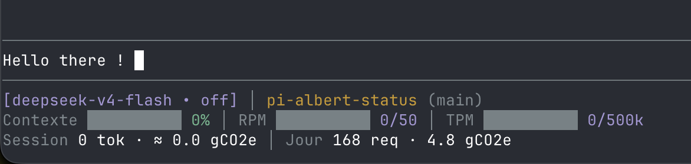

# pi-albert-status

Barre d'état pour [Pi](https://pi.dev) branché sur [Albert API](https://ia.numerique.gouv.fr/outils-ia/albert-api/) à travers [llm-proxy](https://codeberg.org/jbousquie/llm-proxy).

```
[gpt-oss-120b • medium] │ mon-projet (main)
Contexte ███░░░░░░░ 31% │ RPM ██░░░░░░░░ 12/50 │ TPM ████████░░ 200k/246k
Session 481k tok · ≈ 0.1 gCO2e │ Jour 167 req · 4.8 gCO2e │ ⏳ 1 en attente ~12s
```



## Ce qui est affiché

- **Ligne 1** : modèle et niveau de réflexion, dossier courant et branche git.
- **Ligne 2** :
  - **Contexte** : taille de la dernière requête envoyée, rapportée à la fenêtre du modèle ;
  - **RPM / TPM** : requêtes et jetons envoyés sur les 60 dernières secondes, rapportés aux plafonds réglés. Les jauges passent à l'orange à 70 % et au rouge à 90 %.
- **Ligne 3** :
  - **Session** : jetons envoyés et reçus depuis le début de la session, CO2 estimé ;
  - **Jour** : requêtes et CO2 du jour (UTC) selon `GET /v1/me/usage`, pour le compte ou pour une seule clé ;
  - **⏳** : requêtes que le régulateur de llm-proxy retient pour rester sous le quota (`/proxy/attente`). N'apparaît que s'il y en a.

## Installation

Prérequis : Pi 1.0 ou plus, llm-proxy lancé (par défaut sur `http://127.0.0.1:8080`) et un provider Pi qui pointe dessus.

```bash
pi install git:github.com/benoitvx/pi-albert-status
```

Relancer Pi : la barre remplace le pied de page par défaut.

## Réglages

Variables d'environnement, toutes optionnelles :

| Variable | Rôle | Défaut |
|---|---|---|
| `LLM_PROXY_URL` | adresse de llm-proxy | `http://127.0.0.1:8080` |
| `ALBERT_KEY_ID` | identifiant de la clé Albert à suivre dans « Jour » | tout le compte |
| `ALBERT_RPM` | plafond de requêtes par minute affiché | `50` |
| `ALBERT_TPM` | plafond de jetons par minute affiché | `246000` |

Les plafonds par défaut sont ceux de la [grille publique d'Albert API](https://ia.numerique.gouv.fr/outils-ia/albert-api/tarifs-et-limites/) (paliers Expérimentation et Production limitée). Ils ne sont pas lus sur le compte : `/v1/me/info` donne les limites par routeur, sans correspondance avec les noms de modèles.

**Trouver l'identifiant de sa clé** : `/v1/me/keys` masque les jetons, on retrouve une clé par son usage. Après quelques appels, attendre une dizaine de minutes (Albert enregistre l'usage avec retard), puis :

```bash
end=$(date +%s); st=$((end - end % 86400)); B=https://albert.api.etalab.gouv.fr/v1
for i in $(curl -s -H "Authorization: Bearer $ALBERT_API_KEY" "$B/me/keys?limit=100" | jq -r '(.data // .)[].id'); do
  echo "$i $(curl -s -H "Authorization: Bearer $ALBERT_API_KEY" "$B/me/usage?start_time=$st&end_time=$end&key_id=$i" | jq -r '.data[0].requests // 0')"
done | sort -k2 -nr | head
```

## Limites connues

- **Jetons estimés** à 4 caractères par jeton, sur la requête entière. Via le proxy, l'usage renvoyé par Albert à Pi n'est pas exploitable. C'est un ordre de grandeur, pas le décompte d'Albert, qui compte plus large.
- **Débit compté par session Pi** : deux Pi ouverts en parallèle affichent chacun le leur, alors que le quota d'Albert s'applique au compte, modèle par modèle.
- **CO2 de session estimé** : intensité du jour (kg par jeton de sortie, selon Albert) multipliée par les jetons de sortie de la session.
- **« Jour » en retard** de 3 à 10 minutes, le temps qu'Albert enregistre l'usage.
- **⏳ seulement via le proxy** : rien ne s'affiche pour un provider qui appelle Albert en direct.

## Inspiration

Ce projet s'inspire dans son ensemble de [claude-hud](https://github.com/jarrodwatts/claude-hud), la barre d'état de Jarrod Watts pour Claude Code : le concept, les jauges et la mise en page.

## Licence

MIT
